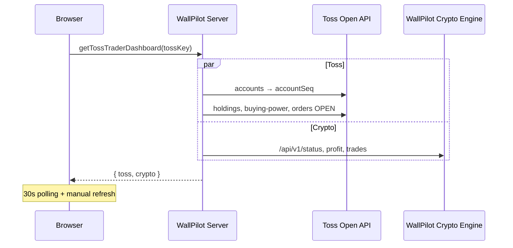

# 토스 트레이더 대시보드 — 상세 기획 보고서

> WallPilot Pro `/toss-trader` — 토스증권 Open API + WallPilot Crypto Engine 통합 트레이더 계기판  
> 작성: 2026-06-25 · 납품 버전 v1

---

## 1. 배경 및 목표

### 1.1 문제 정의
- 트레이더는 **주식(토스)** 과 **크립토(WallPilot Crypto Engine)** 포지션을 각각 다른 앱/탭에서 확인해야 함.
- 주문 전 필요한 정보(매수 가능 금액, 미체결, 보유 평단)가 분산되어 의사결정 지연.
- WallPilot은 이미 Toss 시세·지갑·분할 지정가 API와 크립토 엔진 연동 기반을 보유 → **단일 대시보드**로 통합 가능.

### 1.2 목표 (v1 납품 범위)
| 목표 | 설명 | v1 |
|------|------|-----|
| G1 | 토스 보유 종목·손익·매수 가능 금액 실시간 표시 | ✅ |
| G2 | 미체결 주문 목록 | ✅ |
| G3 | 크립토 봇 손익·상태 스트립 | ✅ |
| G4 | 토스증권 UI 톤 (다크 계기판, KR 상승=빨강) | ✅ |
| G5 | 주문 데스크 UX 기획 + Elite 연동 가이드 | ✅ (기획·CTA) |
| G6 | 실주문 UI (지정가 입력·체결) | 🔜 v2 |

### 1.3 참고: 토스증권 UX 패턴
[토스증권](https://www.tossinvest.com/) 「내 계좌」 화면에서 차용한 요소:
- 상단 **총 평가금액 + 총/일간 손익** (tabular nums)
- **필터 칩**: 전체 / 국내 / 해외
- 종목 row: 이름·수량·평단·현재가·수익률
- **매수 가능 금액** 별도 강조
- 미체결 주문 섹션

WallPilot 확장: **크립토** 필터 + 하단 **WallPilot Crypto Engine** 분석 스트립.

---

## 2. 토스 Open API — 주문·트레이딩 필수 엔드포인트

| API | 용도 | v1 사용 |
|-----|------|---------|
| `GET /api/v1/accounts` | accountSeq 확보 | ✅ |
| `GET /api/v1/holdings` | 보유 종목·평가·손익 | ✅ |
| `GET /api/v1/buying-power` | 매수 가능 현금 | ✅ |
| `GET /api/v1/orders?status=OPEN` | 미체결 주문 | ✅ |
| `GET /api/v1/prices` | 실시간 시세 (배치) | 🔜 v2 호가 패널 |
| `GET /api/v1/orderbook` | 호가창 | 🔜 v2 |
| `POST /api/v1/orders` | 주문 생성 | 🔜 v2 (Elite) |
| `GET /api/v1/orders?status=CLOSED` | 체결·취소 이력 | 🔜 v2 |

**인증**: OAuth2 client_credentials 또는 사용자 `tsck_live_*` 키 → `Authorization: Bearer`  
**계좌 헤더**: `X-Tossinvest-Account: {accountSeq}`

---

## 3. 정보 아키텍처 (1페이지 레이아웃)

```
┌─────────────────────────────────────────────────────────────┐
│ [상태] 토스 연결됨 · #accountSeq          [새로고침 30s]     │
├─────────────────────────────────────────────────────────────┤
│ 총 평가금액 (KRW / USD)                    [총 수익률 %]    │
│ 총손익 | 오늘손익 | 오늘수익률 | 매수가능                    │
├─────────────────────────────────────────────────────────────┤
│ [전체] [국내] [해외] [크립토]  ← 필터 칩                     │
├──────────────────────────┬──────────────────────────────────┤
│ 보유 종목 (60%)          │ 미체결 주문 (40%)                 │
│ · 삼성전자 100주         │ · 005930 BUY PENDING 70,000×10   │
│ · AAPL 5주               │                                  │
│                          │ 주문 데스크 (기획)                │
│                          │ ① 종목·호가 ② 미리보기 ③ 실행    │
├──────────────────────────┴──────────────────────────────────┤
│ 크립토 봇 분석 — USDT 손익 · 상태 · 전략 · 오픈/최대         │
│ [크립토 봇 전체 화면 →]                                       │
└─────────────────────────────────────────────────────────────┘
```

---

## 4. 데이터 흐름



- **Toss 키**: 브라우저 localStorage (`wallpilot.toss.key`) — 서버에 저장하지 않음.
- **Crypto Engine**: Vercel 배포 시 로컬 엔진 직접 연결 불가 → 오프라인 안내 + `/crypto-bot` 링크.

---

## 5. v2 로드맵 (주문 데스크 완성)

| Phase | 기능 | API |
|-------|------|-----|
| 2a | 종목 검색 + 호가 스프레드 | prices, orderbook |
| 2b | 지정가 주문 폼 + 수수료/세금 미리보기 | holdings.cost 참고 |
| 2c | 드라이런 모드 (주문 payload 검증만) | — |
| 2d | Elite 실주문 + 분할 지정가 | POST orders, 기존 split limit |
| 2e | CLOSED 주문 타임라인 + PDF 내보내기 | orders CLOSED |

---

## 6. 권한·메뉴

| 티어 | 보기 | 실행(주문) |
|------|------|-----------|
| free | ✅ | ❌ |
| day_trading | ✅ | ✅ (조회·새로고침) |
| premium | ✅ | ✅ |
| elite | ✅ | ✅ + toss_execute 실주문 |

메뉴 ID: `toss_trader` · 경로: `/toss-trader`

---

## 7. 구현 파일

| 파일 | 역할 |
|------|------|
| `src/lib/api/toss-bridge.server.ts` | holdings, orders, buying-power, snapshot |
| `src/lib/api/toss-trader.functions.ts` | Toss + Crypto 병렬 서버 함수 |
| `src/components/toss-trader/toss-trader-dashboard.tsx` | UI |
| `src/routes/toss-trader/index.tsx` | 라우트 |
| `src/components/auth-button.tsx` | Google 로그인 복구 |

---

## 8. 검증 체크리스트

- [ ] My API에 Toss 키 저장 → 보유 종목 표시
- [ ] 미체결 주문 존재 시 목록 표시
- [ ] WallPilot Crypto Engine 로컬 실행 → 크립토 스트립 온라인
- [ ] Google 로그인 버튼 (Supabase 설정 시) 헤더 표시
- [ ] `/toss-trader` 네비 메뉴 노출 (day_trading+)

---

*본 문서는 고객 납품용 기획·구현 명세서이며, v2 주문 데스크는 별도 SOW로 확장 가능합니다.*
