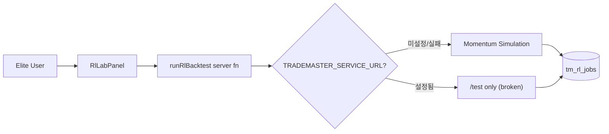
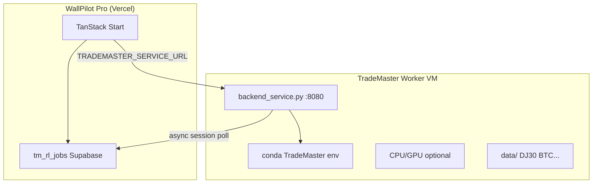

# TradeMaster 연동·업그레이드 기획안 (개발명세서 v1.0)

> 작성일: 2026-06-16  
> 분석 대상: [TradeMaster-NTU/TradeMaster](https://github.com/TradeMaster-NTU/TradeMaster) (`_repo-analysis/TradeMaster`)  
> WallPilot Pro 연동: `/quant/rl-lab` · namespace `tm.*` · elite 등급

---

## 0. Executive Summary

**TradeMaster**는 NTU(HKUST) 연구팀이 만든 **강화학습(RL) 기반 퀀트 트레이딩 풀스택 플랫폼**이다.  
데이터 전처리 → 시장 시뮬레이터 → RL 에이전트 학습/백테스트 → **6축 17지표 평가** → 배포 API까지 한 파이프라인을 제공한다.

WallPilot Pro는 현재 TradeMaster를 **“RL Lab” elite 메뉴**로만 얕게 연동했으며, 워커 미배포 시 **모멘텀 시뮬레이션 폴백**으로 동작한다.  
본 기획안은 TradeMaster의 **진짜 가치(시장 국면 분류 + RL 백테스트 + PRUDEX 평가)** 를 WallPilot의 **스캐너·월가리포트·시그널 허브·토스 실행**과 연결하는 업그레이드 로드맵을 정의한다.

---

## 1. TradeMaster란 무엇인가 — 프로그램 목적

### 1.1 한 줄 정의

> **“금융 자산에 대한 RL 트레이딩 알고리즘을 설계·학습·평가·배포하기 위한 오픈소스 연구/운영 플랫폼”**

공식 문서: [TradeMaster ReadTheDocs](https://trademaster.readthedocs.io/en/latest/) · [TradeMaster.ai](https://trademaster.ai)

### 1.2 6대 핵심 모듈 (README architecture)

| # | 모듈 | 역할 | WallPilot 관점 가치 |
|---|------|------|---------------------|
| 1 | **Multi-modality Market Data** | DJ30, SSE50, BTC, FX, LOB 등 | 백테스트·국면 분석 데이터 소스 |
| 2 | **Data Preprocessing** | yfinance, Alpha158, feature generation | Scanner/Wall Report 피처와 정합 |
| 3 | **Market Simulator (Environments)** | Gym-style RL 환경 | “가상 체험” 백테스트 엔진 |
| 4 | **RL Algorithms (13+)** | PPO, EIIE, SARL, DeepScalper, ETEO… | 전략 후보 자동 생성 |
| 5 | **Evaluation Toolkit (PRUDEX)** | TR, SR, MDD 등 17 measures, radar plot | **전략 신뢰도 점수화** |
| 6 | **Deployment API** | Flask `backend_service.py` | WallPilot sidecar 연동면 |

### 1.3 4가지 QT Task (퀀트 트레이딩 과제)

TradeMaster는 금융 문제를 **4개 task**로 표준화한다.

| Task | 한국어 | 대표 Agent | 시장/데이터 | 투자자 질문 |
|------|--------|------------|-------------|-------------|
| **portfolio_management** | 포트폴리오 배분 | PPO, EIIE, SARL, DeepTrader | DJ30, Exchange | “어떤 비중으로 담을까?” |
| **algorithmic_trading** | 알고리즘 매매 | DeepScalper, DQN | BTC, FX | “언제 사고 팔까?” (단타) |
| **order_execution** | 주문 실행 최적화 | ETEO, PD | BTC LOB | “어떻게 쪼개서 체결할까?” |
| **high_frequency_trading** | 고빈도 | DQN | BTC 1min | 기관/프로 HFT (WallPilot 2차) |

### 1.4 차별 기능 — Market Dynamics Modeling (MDM)

TradeMaster Sandbox의 **킬러 기능**은 “시장 국면(Market Style) 자동 라벨링”이다.

- 입력: OHLCV 시계열 (또는 사용자 CSV 업로드)
- 처리: quantile labeling + DTW merging → **N개 market regime** 분류
- 출력: regime별 라벨 CSV, 시각화 PNG, **regime별 agent 성능 radar chart**
- API: `start_market_dynamics_labeling` → `MDM_status` → `save_market_dynamics_labeling` → `run_dynamics_test`

**WallPilot 활용 포인트:**  
“지금 시장이 추세장인지 횡보장인지”를 **데이터 기반**으로 분류하고, Scanner/Signal Hub의 매수·매도 가이드 **컨텍스트**로 사용.

### 1.5 Model Zoo (주요 논문 기반 알고리즘)

| Agent | 논문/학회 | 적합 task |
|-------|-----------|-----------|
| EIIE | Jiang et al. | Portfolio |
| SARL | AAAI 20 | Portfolio (attention) |
| DeepScalper | CIKM 22 | Intraday |
| PPO/A2C/SAC/DDPG | Ray RLlib | Portfolio |
| ETEO / PD | IJCAI 20 | Order execution |
| Investor-Imitator | KDD 18 | Portfolio (모방학습) |

연구 생태계: EarnHFT, MacroHFT, Market-GAN, FinAgent 등 **TradeMaster 계열 확장 레포**와 federation 가능.

---

## 2. TradeMaster 파일·API 구조 분석

### 2.1 디렉터리 맵

```
TradeMaster/
├── configs/              # task×dataset×agent×optimizer 조합별 Python config
├── data/                 # DJ30, BTC, SSE50, LOB 등 CSV/feather
├── deploy/
│   └── backend_service.py   # Flask REST API (WallPilot sidecar)
├── tools/
│   ├── portfolio_management/train*.py
│   ├── algorithmic_trading/train.py
│   ├── order_execution/train_*.py
│   └── market_dynamics_labeling/run.py
├── trademaster/
│   ├── environments/     # RL Gym 환경
│   ├── trainers/         # 학습 루프
│   ├── nets/             # 신경망 (EIIE, SARL, DQN…)
│   ├── evaluation/       # PRUDEX 지표
│   └── utils/
└── tutorial/             # Jupyter 9종
```

### 2.2 Deploy API 엔드포인트 (backend_service.py)

| Method | Path | 용도 |
|--------|------|------|
| GET | `/api/TradeMaster/getParameters` | task/dataset/agent 목록 |
| POST | `/api/TradeMaster/train` | RL 학습 시작 → `session_id` |
| POST | `/api/TradeMaster/train_status` | 학습 로그, `train_end`, plot |
| POST | `/api/TradeMaster/test` | **학습된 session** 백테스트 |
| POST | `/api/TradeMaster/test_status` | `test_end`, sharpe, TR, MDD |
| POST | `/api/TradeMaster/start_market_dynamics_labeling` | MDM 시작 |
| POST | `/api/TradeMaster/MDM_status` | MDM 진행/시각화 |
| POST | `/api/TradeMaster/save_market_dynamics_labeling` | regime 라벨 저장 |
| POST | `/api/TradeMaster/run_dynamics_test` | regime별 agent 테스트 |
| POST | `/api/TradeMaster/dynamics_testing_status` | radar plot |
| POST | `/api/TradeMaster/upload_csv` | 커스텀 CSV |
| POST | `/api/TradeMaster/download_csv` | 결과 CSV |
| GET | `/api/TradeMaster/healthcheck` | 헬스체크 |

**정상 플로우:** `train` → `train_status`(train_end) → `test` → `test_status`(test_end)  
**MDM 플로우:** `start_market_dynamics_labeling` → `MDM_status`(MDM_end) → `save` → `run_dynamics_test` × N regimes

### 2.3 평가 지표 (test_status / PRUDEX)

- **Sharpe Ratio (SR)**
- **Total Return (TR)**
- **Max Drawdown (MDD)**
- **Win rate**, diversity, risk-control (radar 8축)
- 시각화: `Visualization_test.png`, `radar_plot_agent_{label}.png`

---

## 3. WallPilot Pro 현재 연동 상태 (Gap Analysis)

### 3.1 구현된 것

| 항목 | 파일 | 상태 |
|------|------|------|
| Route | `/quant/rl-lab` | ✅ |
| UI | `rl-lab-panel.tsx` | task/dataset/agent 선택, metrics 카드 |
| DB | `tm_rl_jobs` | job 이력 저장 |
| Server | `rl-lab.server.ts` | job 생성 + 결과 저장 |
| Entitlement | `rl_lab` → elite | ✅ |
| Fallback | `simulateMomentumBacktest()` | 워커 없을 때 degraded |

### 3.2 치명적 Gap (업그레이드 필수)

| # | 문제 | 영향 |
|---|------|------|
| **G1** | `config.server.ts`에 **`TRADEMASTER_SERVICE_URL` 미등록** | env 설정해도 항상 폴백 |
| **G2** | `fetchExternalBacktest`가 **`/test`만 호출**, `/train` 생략 | TradeMaster API 계약 위반 → 실패 |
| **G3** | `session_id` 없이 test 호출 | 100% null 반환 |
| **G4** | equity curve 미수신 (TradeMaster test_status는 plot base64만) | 차트 빈 상태 |
| **G5** | MDM·regime test·upload_csv **미연동** | TradeMaster 핵심 가치 미활용 |
| **G6** | 사용자 tickers 입력이 TradeMaster에 **전달되지 않음** | UI와 엔진 불일치 |
| **G7** | Vercel serverless에서 **GPU 학습 불가** | sidecar VM 필수 |
| **G8** | KR 종목(005930) preset 있으나 **TradeMaster dataset 없음** | 한국 주식 RL 미지원 |

### 3.3 현재 아키텍처 (As-Is)



---

## 4. WallPilot에서 TradeMaster를 “어떻게 쓸 것인가”

### 4.1 포지셔닝 — RL Lab ≠ 자동매매

TradeMaster는 WallPilot에서 **“전략 검증·시장 국면 분석 엔진”**으로 쓴다.  
**직접 Toss 자동주문과 연결하지 않는다** (규제·리스크·latency). 대신:

1. **Scanner 후보** → RL Lab 백테스트 → “이 종목·전략 조합이 과거에 통했는가?”
2. **Wall Report** → MDM regime → “지금 시장 국면에 맞는 전략인가?”
3. **Signal Hub Navigator** → regime + agent radar → **채택(Adopt) 근거** 제공
4. **Toss Execute (elite)** → 사용자가 **수동 확인 후** 주문 (RL은 참고 지표)

### 4.2 사용자 여정 (To-Be)

```
[Scanner] 종목 후보 NVDA, 005930
     ↓ "RL Lab에서 검증"
[RL Lab] Portfolio / PPO / DJ30 (+ 사용자 watchlist proxy)
     ↓ train → test (비동기 job, 5~30분)
[결과] Sharpe, MDD, equity curve, PRUDEX radar
     ↓ "Signal Hub에 채택"
[Navigator] Evaluate 단계 카드: "PPO portfolio · SR 1.2 · regime 2 적합"
     ↓ 사용자 Adopt
[Notebook] 진입/청산 체크리스트 + Toss 시세 맥락
     ↓ (선택) Toss Execute
[주문] 사용자 확인 후 실행
```

### 4.3 WallPilot 모듈별 연동 매트릭스

| WallPilot 모듈 | TradeMaster 활용 | 연동 방식 |
|----------------|------------------|-----------|
| **Scanner** | 후보 tickers → RL job 입력 | `sessionStorage` / API param |
| **Wall Report** | valuation + regime overlay | MDM on index/custom CSV |
| **Signal Hub** | agent signal as NavFeedItem | `source: trademaster` |
| **Agent Desk** | TradingAgents vs RL 비교 | parallel jobs |
| **DARTLAB** | 펀더멘털 + regime | custom CSV upload |
| **Toss API** | holdings → backtest universe | tickers from portfolio |
| **Admin** | worker health, queue | healthcheck + audit |

---

## 5. 업그레이드 기획 — 4 Tier 제품 가치

### 5.1 elite “RL Lab” 기능 단계

| 단계 | 기능 | TradeMaster API | 사용자 가치 |
|------|------|-----------------|---------------|
| **L0** (현재) | 폴백 시뮬레이션 | 없음 | UI 체험만 |
| **L1** | 실제 train→test 백테스트 | train, test, status | **진짜 RL metrics** |
| **L2** | MDM regime labeling | MDM 전체 | **시장 국면 가이드** |
| **L3** | Regime별 agent 비교 | dynamics_test | **국면별 최적 전략** |
| **L4** | Custom CSV (KR OHLCV) | upload_csv | **한국 종목 확장** |
| **L5** | Scanner/Hub/Report 연동 | orchestration | **End-to-end Navigator** |

### 5.2 인프라 아키텍처 (To-Be)



**권장 스펙**

- OS: Ubuntu 22.04
- RAM: 16GB+ (학습), 8GB (test-only)
- GPU: optional (portfolio PPO는 CPU 가능, HFT는 GPU 권장)
- Python 3.9 + conda env `TradeMaster`
- Reverse proxy: Cloudflare Tunnel / nginx + TLS
- Env: `TRADEMASTER_SERVICE_URL=https://tm-worker.example.com`

**Vercel 제약**

- `maxDuration` 60~300s → **학습은 반드시 비동기 job + polling**
- WallPilot server fn은 **job 생성·status poll만** (학습 자체는 sidecar)

---

## 6. 기술 업그레이드 명세

### 6.1 Phase TM-1 — 연동 수정 (필수, 1주)

**목표:** 실제 TradeMaster worker 연결 시 동작하게 만들기

| 작업 | 파일 |
|------|------|
| `TRADEMASTER_SERVICE_URL` config 추가 | `config.server.ts` |
| train → poll train_status → test → poll test_status 파이프라인 | `rl-lab.server.ts` 신규 `trademaster-client.server.ts` |
| job status `queued/running` 유지, 클라이언트 poll | `tm_rl_jobs.status` |
| `getParameters`로 preset 동기화 | `listRlPresets()` |
| healthcheck admin 표시 | `admin/security` 또는 My API |
| 테스트 | `scripts/test-trademaster-client.ts` |

**train 요청 예 (TradeMaster contract)**

```json
{
  "task_name": "portfolio_management",
  "dataset_name": "portfolio_management:dj30",
  "agent_name": "portfolio_management:ppo",
  "optimizer_name": "adam",
  "loss_name": "mse"
}
```

**응답:** `{ "session_id": "uuid", "error_code": 0 }`

### 6.2 Phase TM-2 — RL Lab UX 업그레이드 (2주)

| 기능 | 설명 |
|------|------|
| **비동기 Job UI** | running 중 progress log tail, cancel |
| **Equity curve** | test 결과 CSV 파싱 또는 worker extension |
| **PRUDEX radar** | base64 plot → `` 렌더 |
| **Preset 확장** | getParameters 전체 agent 목록 |
| **에러 transparency** | `degraded` vs `failed` vs `trademaster` badge |
| **PDF export** | premium+ RL report (metrics + chart) |

### 6.3 Phase TM-3 — Market Dynamics (MDM) Lab (2~3주)

**신규 UI 탭:** RL Lab 내 **“시장 국면”** 서브패널

| Step | API | UI |
|------|-----|-----|
| 1 | `start_market_dynamics_labeling` | dataset, regime 수, date range |
| 2 | poll `MDM_status` | progress + labeling visualization |
| 3 | `save_market_dynamics_labeling` | regime 저장 |
| 4 | `run_dynamics_test` × N | regime별 radar |
| 5 | poll `dynamics_testing_status` | 비교 테이블 |

**WallPilot 가치:**  
Wall Report / Scanner 결과 종목의 **최근 1년 OHLCV**를 custom CSV로 upload → “현재 국면 = 3 (변동성 확대)” → Signal Hub **Evaluate** 카드 자동 생성.

### 6.4 Phase TM-4 — 한국·토스 연동 (3~4주)

| 항목 | 방안 |
|------|------|
| KR OHLCV | Toss/yfinance/Korea MCP → CSV → `upload_csv` |
| Watchlist tickers | Signal Hub `nav_watchlist_items` → job tickers |
| Holdings universe | Toss holdings API → portfolio backtest 입력 |
| Regime → Signal | MDM label을 `NavFeedItem.navigatorStage` hint |

TradeMaster native KR dataset: **HS Tech 30** (AKShare) — preset 추가 검토.

### 6.5 Phase TM-5 — Orchestration & Signal Hub (2주)

- Scanner “RL 검증” 버튼 → `/quant/rl-lab?tickers=...`
- RL job 완료 → Signal Hub에 **Adopt 가능 카드** push (`source: trademaster`)
- Agent Desk deep report ↔ RL metrics **side-by-side** 비교 뷰

---

## 7. 데이터 모델 확장 (Supabase)

```sql
-- tm_rl_jobs 확장 (migration)
alter table tm_rl_jobs add column if not exists
  trademaster_session_id text,
  phase text check (phase in ('train','test','mdm','dynamics_test')),
  progress_log text,
  radar_plot_base64 text,
  regime_labels jsonb default '[]';

-- regime 결과 캐시
create table if not exists tm_market_regimes (
  id uuid primary key default gen_random_uuid(),
  user_id uuid references profiles(id),
  symbol text,
  regime_count int,
  labels jsonb,
  visualization_base64 text,
  created_at timestamptz default now()
);
```

---

## 8. API Wrapper 설계 (WallPilot server)

**신규:** `src/lib/modules/tm/trademaster-client.server.ts`

```typescript
export async function tmHealth(): Promise<boolean>;
export async function tmGetParameters(): Promise<TmParameters>;
export async function tmStartTrain(params: TmTrainParams): Promise<string>; // session_id
export async function tmPollTrain(sessionId: string): Promise<TmTrainStatus>;
export async function tmStartTest(sessionId: string): Promise<void>;
export async function tmPollTest(sessionId: string): Promise<TmTestResult>;
export async function tmStartMdm(params: TmMdmParams): Promise<string>;
export async function tmPollMdm(sessionId: string): Promise<TmMdmStatus>;
```

**Job orchestrator:** `createRlJob` → insert `running` → background poll (Vercel waitUntil / cron / client poll)

---

## 9. 권한·과금

| 기능 | 등급 |
|------|------|
| Fallback simulation | elite (현재) |
| Real TradeMaster backtest | elite |
| MDM regime | elite |
| Custom CSV upload | elite |
| PDF RL report | premium+ (선택) |
| Job queue priority | elite > premium |

**리소스 쿼터 (권장)**

- elite: 10 jobs/day, max 1 concurrent train
- admin: unlimited

---

## 10. 리스크 및 대응

| 리스크 | 대응 |
|--------|------|
| 학습 30분+ 소요 | 비동기 + email/Toast 완료 알림 |
| conda/GPU 운영 부담 | test-only mode (pretrained checkpoint) |
| 과거 수익률 ≠ 미래 | UI disclaimer + Adopt 확인 문구 |
| TradeMaster KR 미약 | custom CSV + HS30 dataset |
| API breaking change | `trademaster-client` adapter layer |
| Worker 단일 장애점 | healthcheck + fallback simulation |

---

## 11. 성공 지표 (KPI)

| KPI | 목표 |
|-----|------|
| Worker 연결률 | elite 사용자 중 80%+ health OK |
| Real backtest 비율 | jobs 중 `source=trademaster` ≥ 50% |
| Job 완료율 | ≥ 90% (failed 제외) |
| MDM adoption | RL Lab 사용자 30%+ regime 분석 사용 |
| Signal Hub Adopt from TM | 월 100+ cards |
| Scanner → RL Lab CTR | ≥ 15% |

---

## 12. 구현 우선순위 요약

| 순위 | Phase | 기간 | 산출물 |
|------|-------|------|--------|
| **P0** | TM-1 연동 수정 | 1주 | worker 실동, config fix |
| **P1** | TM-2 UX | 2주 | async job, radar, curve |
| **P2** | TM-3 MDM | 3주 | regime lab |
| **P3** | TM-4 KR/Toss | 4주 | watchlist CSV pipeline |
| **P4** | TM-5 Hub 연동 | 2주 | Navigator cards |

---

## 13. 즉시 실행 체크리스트 (P0)

- [ ] `config.server.ts`에 `trademasterServiceUrl: process.env.TRADEMASTER_SERVICE_URL ?? ""` 추가
- [ ] GPU/CPU VM에 `deploy/backend_service.py` 배포 (conda `TradeMaster`)
- [ ] Vercel env `TRADEMASTER_SERVICE_URL` 등록
- [ ] `trademaster-client.server.ts` — train→test 정석 플로우
- [ ] `rl-lab.server.ts` 리팩터 — broken `/test`-only 제거
- [ ] `npm run test:trademaster-client` — mock + integration flag
- [ ] Admin Security에 worker healthcheck 표시

---

## 14. 참고 자료

- TradeMaster GitHub: https://github.com/TradeMaster-NTU/TradeMaster
- NeurIPS 2023 TradeMaster paper (README Publications)
- WallPilot 현재 코드: `src/lib/modules/tm/rl-lab.server.ts`, `src/components/modules/rl-lab-panel.tsx`
- TradeMaster deploy: `_repo-analysis/TradeMaster/deploy/backend_service.py`
- 관련 기획: `docs/SIGNAL_HUB_NAVIGATOR_SPEC.md` (regime → Navigator Adopt)

---

*본 명세는 `docs/TRADEMASTER_UPGRADE_SPEC.md`에 유지하며, TM-1 완료 시 v1.1로 worker 배포 runbook을 추가한다.*
