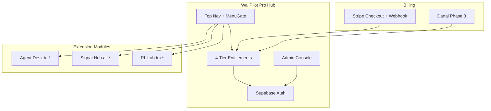

# WallPilot Pro — 확장 개발명세서 (SaaS)

> 버전: 1.0 · 작성일: 2026-06-16 · 베이스: WallPilot → **WallPilot Pro**

---

## 1. 프로젝트 개요

WallPilot Pro는 기존 WallPilot(TanStack Start + Supabase + Stripe + Gemini + Toss)을 **4등급 구독 SaaS**로 확장하고, 외부 트레이딩 레포 기능을 **상단 메뉴 확장 모듈**로 개별 탑재하는 플랫폼이다.

### 1.1 목표

- Google OAuth 회원 + 4등급 구독(무료/단타/프리미엄/엘리트)
- 등급별 메뉴 열람·실행·PDF 출력 권한
- Stripe(글로벌) + Danal(국내) 결제
- 관리자: 가입승인, 등급관리, 권한매트릭스, 활동로그, 보안감사
- 외부 레포 모듈을 **네임스페이스 분리**로 충돌 없이 확장

---

## 2. 현재 WallPilot 분석 요약

| 영역 | 구현 상태 |
|------|-----------|
| 프레임워크 | TanStack Start + Vite + Nitro(Vercel) |
| 인증 | Supabase Google OAuth, pending/active/suspended |
| 결제 | Stripe Checkout (Pro/Premium), 웹훅 **미구현** |
| 티어 | Free / Pro / Premium(=elite DB) — **3티어** |
| 메뉴 | 스캐너, Wall Report, AI Pilot, My API, Pricing, Admin |
| 관리자 | 회원 승인·정지·삭제·플랜 수동변경 |
| 트레이딩 | Reverse-Quant, Bull/Bear, Risk Gate, Toss 실행 |

---

## 3. 외부 레포 분석 및 메뉴 확장 설계

### 3.1 분석 완료 레포

| 레포 | 스택 | 확장 메뉴 | Route | Namespace |
|------|------|-----------|-------|-----------|
| **tradingagents** | Python/LangGraph | 에이전트 분석 | `/agents/desk` | `ta.*` |
| **AI-Trader** | FastAPI + React | 시그널 허브 | `/signals` | `ait.*` |
| **TradeMaster** | Python RL/GPU | RL 연구소 | `/quant/rl-lab` | `tm.*` |
| **fireauto** | Claude Plugin | 보안 센터 (Admin) | `/admin/security` | `fa.secure.*` |

### 3.2 미클론 레포 (추후 Phase)

| 레포 | 상태 | 비고 |
|------|------|------|
| Vibe-Trading | GitHub 미발견 (HKUDS/Vibe-Trading) | AI-Trader P2 이후 federation |
| QuantDinger | GitHub 미발견 | URL 확인 후 별도 평가 |

### 3.3 충돌 방지 원칙

```
Routes:  /agents/*  /signals/*  /quant/*  /admin/*
API:     /api/ta/*  /api/ait/*  /api/tm/*
Env:     TRADINGAGENTS_*  AIT_*  TRADEMASTER_*
DB:      ta_*  ait_*  tm_* (확장 테이블만, 코어는 Supabase)
Entitlements: agent_desk, signals_read, signals_write, rl_lab (독립 feature key)
```

각 모듈은 **독립 route + server fn + entitlement** 로 탑재. WallPilot 코어(scan/ai-pilot/toss)와 코드 공유 최소화.

---

## 4. 회원 등급 체계 (4-Tier)

| 등급 | ID | DB plan | 월 요금(기본) | Stripe env |
|------|-----|---------|---------------|------------|
| 무료 회원 | `free` | `free` | ₩0 | — |
| 단타 회원 | `day_trading` | `pro` (legacy: basic) | ₩39,000 / $29 | `STRIPE_PRICE_PRO` |
| 프리미엄 회원 | `premium` | `premium` | ₩99,000 / $59 | `STRIPE_PRICE_PREMIUM` |
| 엘리트 회원 | `elite` | `elite` | ₩199,000 / $99 | `STRIPE_PRICE_ELITE` |

> Danal: `DANAL_*` env — Phase 3에서 Stripe와 병행, 동일 plan_id 매핑.

### 4.1 기능-등급 매트릭스 (기본값)

| 메뉴/기능 | free | day_trading | premium | elite |
|-----------|:----:|:-----------:|:-------:|:-----:|
| 스캐너 미리보기 | ✓ | ✓ | ✓ | ✓ |
| 스캐너 전체 실행 | | ✓ | ✓ | ✓ |
| Wall St. Report | | ✓ | ✓ | ✓ |
| PDF 출력 | | | ✓ | ✓ |
| AI Pilot | | | ✓ | ✓ |
| 에이전트 분석 (TA) | | | ✓ | ✓ |
| 시그널 허브 읽기 | ✓ | ✓ | ✓ | ✓ |
| 시그널 허브 게시/카피 | | ✓ | ✓ | ✓ |
| RL 연구소 | | | | ✓ |
| Toss 주문 실행 | | | | ✓ |
| My API | ✓ | ✓ | ✓ | ✓ |

관리자 UI(`/admin/permissions`)에서 `menu_tier_permissions` 테이블로 **기본값 오버라이드** 가능.

---

## 5. 상단 메뉴 구조 (확장 후)

| 순서 | 라벨 (KO) | Route | 모듈 | 최소 등급 |
|------|-----------|-------|------|-----------|
| 1 | 스캐너 | `/` | WallPilot | free |
| 2 | 월가리포트 | `/wall-street-report` | WallPilot | day_trading |
| 3 | AI Pilot | `/ai-pilot` | WallPilot | premium |
| 4 | 에이전트 분석 | `/agents/desk` | tradingagents | premium |
| 5 | 시그널 허브 | `/signals` | AI-Trader | free(읽기) |
| 6 | RL 연구소 | `/quant/rl-lab` | TradeMaster | elite |
| 7 | My API | `/my-api` | WallPilot | free |
| 8 | 요금제 | `/pricing` | WallPilot | free |
| — | 관리자 | `/admin/*` | WallPilot | role=admin |

---

## 6. 관리자 시스템

### 6.1 Admin 서브메뉴

| Route | 기능 |
|-------|------|
| `/admin` | 회원 목록·승인·정지·탈퇴·플랜·역할 |
| `/admin/permissions` | 등급별 메뉴 권한 매트릭스 (view/execute/pdf) |
| `/admin/activity` | 로그인·페이지 열람·PDF 출력·기능 실행 로그 |
| `/admin/security` | fireauto 8-category 보안 감사 실행·결과 |

### 6.2 회원 생애주기

```
Google 가입 → pending → [관리자 승인 | AUTH_AUTO_APPROVE] → active
       ↓
Stripe/Danal 결제 → webhook → plan/status 자동 갱신 → 등급 확대
       ↓
구독 만료/취소 → past_due/canceled → free entitlements
       ↓
관리자 suspend/delete → 접근 차단 + audit log
```

### 6.3 이메일 (Phase 2)

- 가입 승인/거부
- 구독 시작/갱신/만료
- Resend 또는 Supabase Edge Function + SMTP

---

## 7. 결제 시스템

### 7.1 Stripe (Phase 1)

- Checkout Session: day_trading(pro), premium, elite
- **Webhook** `/api/stripe/webhook`: `checkout.session.completed`, `customer.subscription.updated/deleted`
- Customer Portal (Phase 2)

### 7.2 Danal (Phase 3)

- REST API 카드 결제 → 동일 `subscriptions.plan` 업데이트
- `payment_provider`: stripe | danal

---

## 8. 데이터베이스 확장

### 8.1 신규 테이블

- `menu_tier_permissions` — 등급별 메뉴 view/execute/pdf
- `user_activity_log` — 로그인, page_view, feature_execute, pdf_export
- `security_audit_log` — fireauto 감사 실행 결과

### 8.2 plan 확장

`subscriptions.plan`에 `premium` 추가. legacy `basic`/`pro` → day_trading tier 매핑.

---

## 9. fireauto 보안 통합

fireauto `fireauto-secure` skill의 8-category 패턴을 서버 감사 모듈로 포팅:

1. 시크릿 노출  2. Auth/RLS  3. Rate limit  4. Upload
5. Storage  6. Prompt injection  7. Info leak  8. Dependencies (npm audit)

Admin `/admin/security`에서 실행 → `security_audit_log` 저장.

---

## 10. 구현 페이즈 (권장 순서)

| Phase | 내용 | 산출물 |
|-------|------|--------|
| **P1** | 4티어·메뉴 레지스트리·권한 guard·Admin 확장·activity log·Stripe webhook | ✅ 본 커밋 |
| **P2** | tradingagents sidecar + `/agents/desk` 실기능 | FastAPI wrapper |
| **P3** | AI-Trader federation + `/signals` | API proxy |
| **P4** | TradeMaster inference + `/quant/rl-lab` | GPU sidecar |
| **P5** | Danal 결제 + 이메일 알림 + Customer Portal | |
| **P6** | Vibe-Trading / QuantDinger (URL 확보 후) | |

---

## 11. 환경 변수 (추가)

```env
STRIPE_PRICE_PREMIUM=
DANAL_CLIENT_ID=
DANAL_CLIENT_SECRET=
RESEND_API_KEY=
TRADINGAGENTS_SERVICE_URL=
AIT_SERVICE_URL=
TRADEMASTER_SERVICE_URL=
```

---

## 12. 검증 체크리스트 (P1)

- [ ] 4티어 pricing UI 표시
- [ ] Header: 등급 미달 메뉴 숨김/잠금
- [ ] MenuGate: 라우트 접근 차단 + 업그레이드 CTA
- [ ] Admin permissions: 매트릭스 조회·저장
- [ ] Admin activity: 로그인·page_view 기록 조회
- [ ] Admin security: 감사 실행·결과 표시
- [ ] Stripe webhook handler (서버 fn)
- [ ] `npm run test:wallpilotpro-p1` 통과

---

## 13. 아키텍처 다이어그램



---

*본 명세서는 wallpilotpro 리포 `docs/WALLPILOTPRO_EXPANSION_SPEC.md`에 유지하며, 페이즈 완료 시 버전을 갱신한다.*
